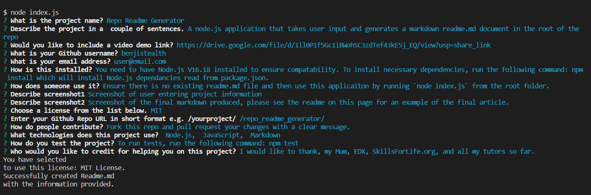
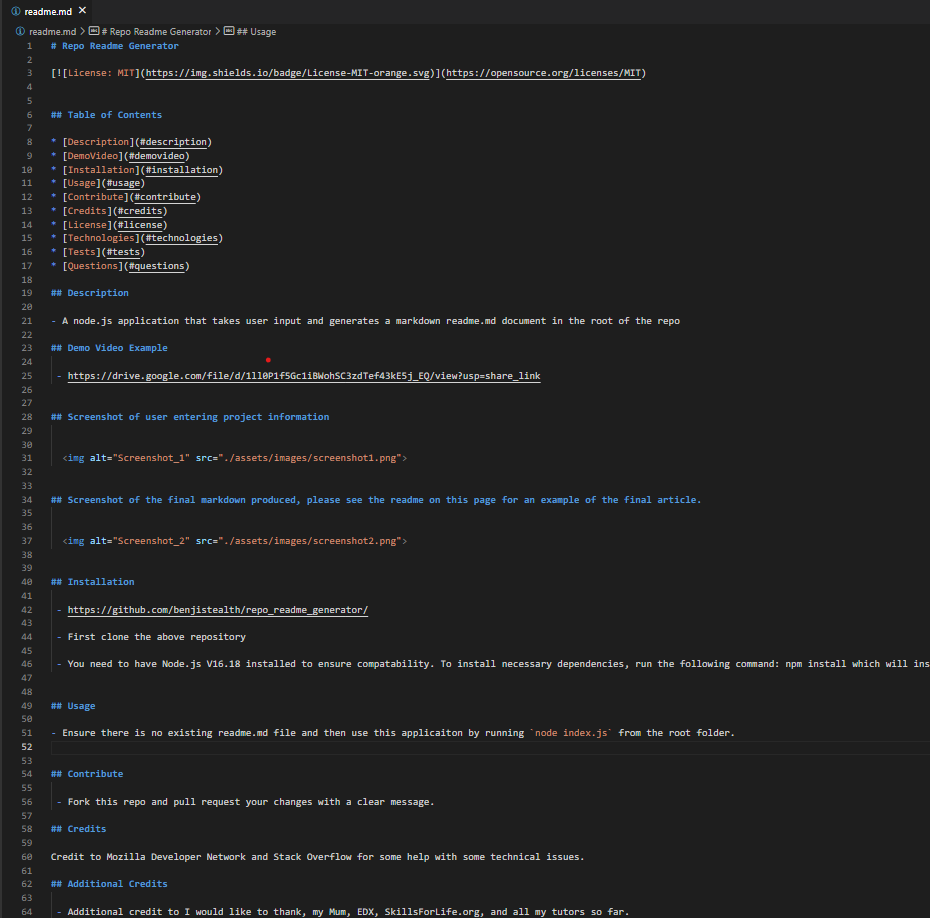

# kuyiluyli
                       

## Table of Contents

* [Description](#description)
* [Installation](#installation)
* [Usage](#usage)
* [Contribute](#contribute)
* [Credits](#credits)
* [License](#license)
* [Technologies](#technologies)
* [Tests](#tests)
* [Questions](#questions)

## Description

- yilkuyiluli

## uoluo;oiu;

    
  

## uo;iuo;i

  

## Installation

https://github.com/uilliuolo;iou;i8;'9

First clone the above repository

uilliuuo

## Usage

- uiluo;lo;

## Contribute

 - ululiuol

## Credits

Credit to Mozilla Developer Network and Stack Overflow for some help with some technical issues.

## Additional Credits

 - Additional credit to uo;uo;

## License

 - This project is licensed under the  located in the root of the repository. 

## Technologies Used

 - 

## Tests
 - How to test the project:

 - ou;luo;

## Questions
If you have any questions about the repo, please open an issue.

 - Github Username - uilliuol

 - This Repo Issues - https://github.com/uilliuolo;iou;i8;'9issues/

# iluil
                       

## Table of Contents

* [Description](#description)
* [Installation](#installation)
* [Usage](#usage)
* [Contribute](#contribute)
* [Credits](#credits)
* [License](#license)
* [Technologies](#technologies)
* [Tests](#tests)
* [Questions](#questions)

## Description

- yilyuli7

## u79;89

    
  

## ;80

  

## Installation

https://github.com/yl7l78;80;890

First clone the above repository

y7l79p

## Usage

- uil79;7

## Contribute

 - 980;80;80

## Credits

Credit to Mozilla Developer Network and Stack Overflow for some help with some technical issues.

## Additional Credits

 - Additional credit to uiluilu

## License

 - This project is licensed under the  located in the root of the repository. 

## Technologies Used

 - 

## Tests
 - How to test the project:

 - ululuilu

## Questions
If you have any questions about the repo, please open an issue.

 - Github Username - yl7l7

 - This Repo Issues - https://github.com/yl7l78;80;890issues/

# ilkyiluli
                       

## Table of Contents

* [Description](#description)
* [Installation](#installation)
* [Usage](#usage)
* [Contribute](#contribute)
* [Credits](#credits)
* [License](#license)
* [Technologies](#technologies)
* [Tests](#tests)
* [Questions](#questions)

## Description

- uiluilul

## uo;uo;

    
  

## uoi;oiu;oi

  

## Installation

https://github.com/uiluiluilio;io;

First clone the above repository

uiluoiluol;

## Usage

- uluo;luo

## Contribute

 - io;io;iu

## Credits

Credit to Mozilla Developer Network and Stack Overflow for some help with some technical issues.

## Additional Credits

 - Additional credit to uo;uo;

## License

 - This project is licensed under the  located in the root of the repository. 

## Technologies Used

 - Unknown Technology!

## Tests
 - How to test the project:

 - ou;u;

## Questions
If you have any questions about the repo, please open an issue.

 - Github Username - uiluiluil

 - This Repo Issues - https://github.com/uiluiluilio;io;issues/

